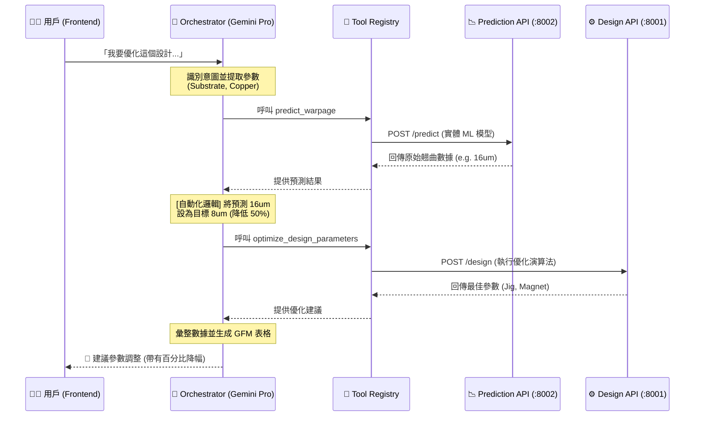

# Orchestrator API (The AI Brain) 技術詳解

本模組是整個協作平台的「核心大腦」，負責解析用戶自然語言，並自動調度、串接後端的設計與預測服務。

## 🤖 Orchestrator 的核心演進 (Comparison)

相較於剛下載的原始專案（僅有基礎 API），Orchestrator API 帶來了以下關鍵新增：
1. **意圖推理引擎 (Reasoning Engine)**：不再只是簡單的關鍵字匹配，而是能理解複雜的「如果...會怎樣 (What-if)」或「跑掃描 (Sweep)」等高難度請求。
2. **自動化工具鏈串接 (Tool Chaining)**：能將「預測結果」自動轉換為「優化目標」，達成全自動的閉環設計流程。
3. **上下文感知 (Context Awareness)**：能夠在多輪對話中記住基板尺寸與銅含量，減少用戶重複輸入。

---

## 📐 系統整合流程架構 (Full Chaining Architecture)

以下展示 Orchestrator 如何作為中樞，調度其他 API 服務：

---

## 🧩 核心組件說明

### 1. `llm_agent.py` (推理核心)
- **SYSTEM_PROMPT**：定義了嚴格的推理規則與回覆樣板。
- **Few-Shot Prompting**：針對複雜情境（如參數掃描）配置了專屬的 Markdown 渲染規則。

### 2. `tool_registry.py` (工具代理層)
- **負載均衡**：負責將 LLM 的調用指令翻譯為具體的 HTTP 請求發送至 Port 8001/8002。
- **日誌追蹤**：內建 `[AGENT] 執行工具` 輸出，保證 Demo 時數據的真實性。

### 3. `ChatPanel.jsx` (渲染前端)
- **GFM Parser**：升級後的 Markdown 解析器，專門處理 Orchestrator 產出的複雜數據表格與 Icon。

---

## 📈 典型呼叫鏈結範例 (Example: Parameter Sweep)

當觸發「參數掃描」時，Orchestrator 會執行以下操作：
1. **點位採樣**：自主決定採樣區間 (0.5mm ~ 2.0mm)。
2. **並發預測**：針對採樣點重複呼叫 `predict_warpage` 實體 API。
3. **數據彙總**：比較所有結果，標註翹曲最低點 (Optimal Point)。
4. **視覺化輸出**：產出符合相容性要求的 Markdown Table 原始碼。

---
*文檔更新日期：2026-03-20*
